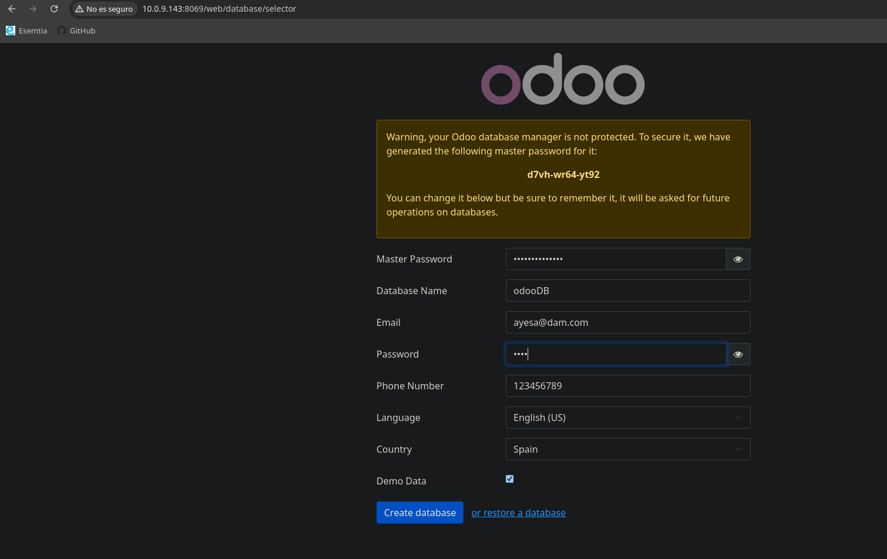
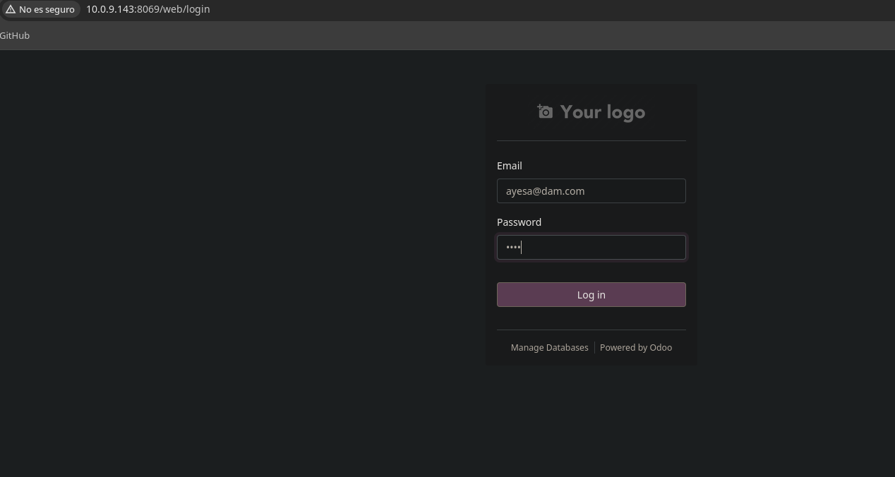
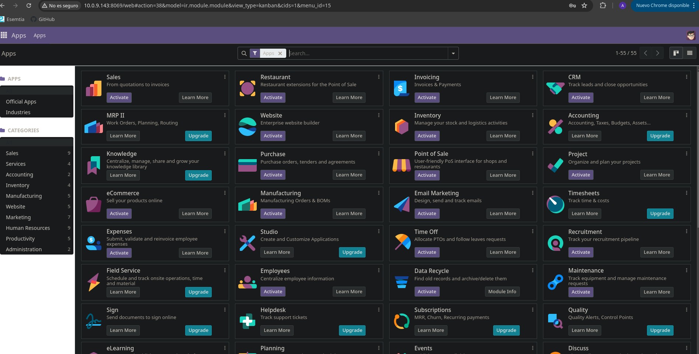
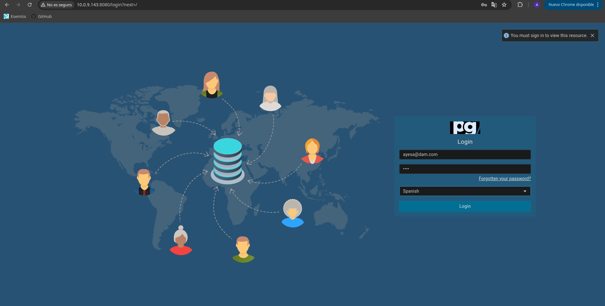
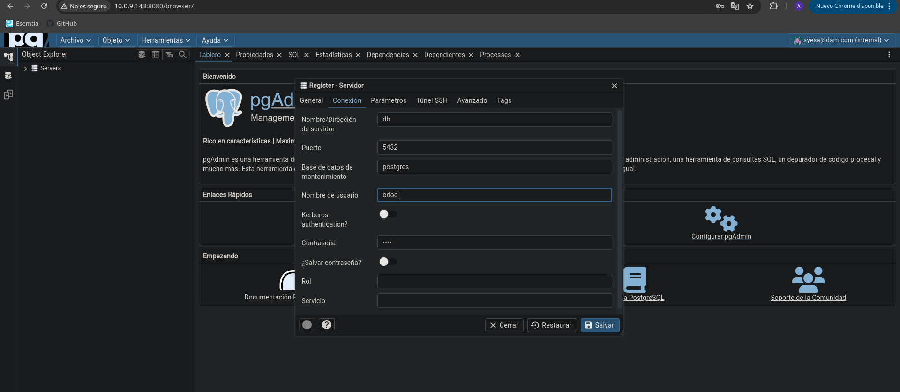
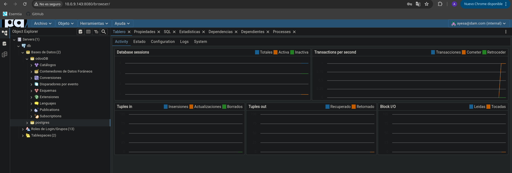

# Instalación Odoo Community v.17

Guía que muestra los pasos para instalar Odoo, PostgreSQL y PgAdmin

## Creación del archivo compose

```bash
# Montar una carpeta para almacenar el archivo compose.yml
mkdir compose_Odoo

# Colocarse en la carpeta recien creada
cd compose_Odoo

# Creación del archivo compose.yml
nano docker-compose.yml
```

Contenido del archivo

```yml
services:
  web: #servicio Odoo
    image: odoo:17.0 #imagen odoo
    restart: always #siempre reiniciar en caso de error
    depends_on:
      - db
    ports: #puertos
      - "8069:8069"
    volumes:
      - odoo-web-data:/var/lib/odoo
      - ./config:/etc/odoo
      - ./addons:/mnt/extra-addons
    environment: #variables de entorno
      - HOST=db #host de la base de datos
      - USER=odoo #usuario de la base de datos
      - PASSWORD=odoo #contraseña de la base de datos
  db: #servicio de base de datos
    image: postgres:15
    ports:
      - "5432:5432"
    environment:
      - POSTGRES_DB=postgres
      - POSTGRES_PASSWORD=odoo
      - POSTGRES_USER=odoo

  pgadmin: #servicio de pgadmin
    image: dpage/pgadmin4
    restart: always
    ports:
      - "8080:80"
    environment:
      PGADMIN_DEFAULT_EMAIL: ayesa@dam.com
      PGADMIN_DEFAULT_PASSWORD: 1234
    depends_on:
      - db
volumes:
  odoo-web-data:
```
Puesta en marcha
    
```bash
# Ejecución en segundo plano (deja libre la terminal)
docker compose up -d

# Ejecución en primer plano  (muestra el log de los contenedores)
docker compose up 
```

## Acceso e instalación

### Odoo

Accedemos a Odoo a través de:

```bash
http://localhost:8069
```
La página resultante debe ser similar a la siguiente:


Una vez introducidos los datos, pulsamos en "Crear base de datos" y se nos redirigirá a la página de login.


Iniciamos y nos redirigirá a la página principal de Odoo.


### PgAdmin

Acedemos a nuestra instalación de pgAdmin mediante:

```bash
http://localhost:8080
```

La página resultante debe ser similar a la siguiente:


Una vez introducidos los datos que especificamos en el archivo compose.yml, tendremos acceso a la página principal de nuestra sesión. Aquí podemos conectar nuestro servidor con los datos de Odoo seleccionando la opción: Agregar nuevo servidor.


Tras conectar correctamente la base de datos con pgAdmin, podremos visualizar los datos de Odoo desde la página.


## Preguntas

#### ¿Que ocurre si en el ordenador local el puerto 5432 está ocupado?
Nos dara error porque el puerto ya esta siendo usado, tendriamos que detener el proceso que lo esta usando o cambiar el puerto en el compose

Cambiar puerto para la base de datos en docker-compose.yml:
```bash
db:
  ports:
    - "5433:5432"
```
 
Usa el puerto 5433 para conectarte desde PgAdmin.
#### ¿Y si lo estuviese el 8069?
Nos dara error porque el puerto ya esta siendo usado, tendriamos que detener el proceso que lo esta usando o cambiar el puerto en el compose

1. Cambiar puerto para Odoo en docker-compose.yml:
```bash
web:
  ports:
    - "8070:8069"
```
2. Accede a Odoo usando http://localhost:8070.
